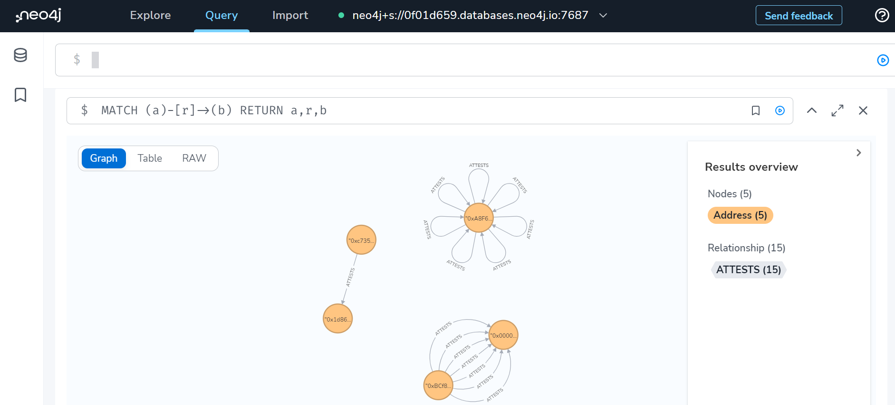

# optimism-graph

### Overview

Optimism launched an [attestation station](https://community.optimism.io/docs/governance/attestation-station/) which aims to create a curated ecosystem of reputable users. We index the attestation data into a social graph which could be used for a multitude of use cases such as deriving trasistive trust, computing Eigentrust or understanding the social context of a particular user. Feel free to reach out if you have more ideas! 

### Getting Started

To visualize the social graph of the Optimism attestation station, head to [Neo4J Desktop](https://workspace-preview.neo4j.io/workspace/query). Put in the following details:
* Scheme: neo4j + s
* Connection URL: 0f01d659.databases.neo4j.io:7687
* Database user: neo4j

Obtain the password from admin. 

Once you are logged in, select the `Query` tab on top. Enter the following command to view the entire social graph `MATCH (a)-[r]->(b) RETURN a,r,b`.

